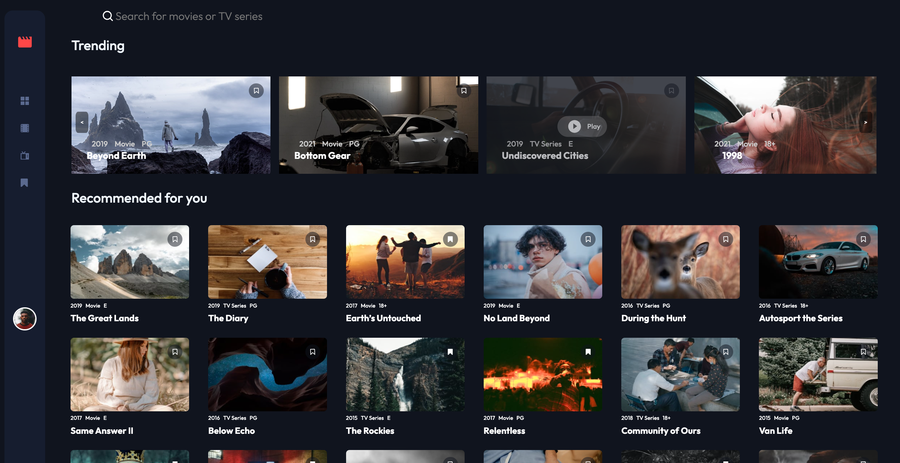

# Frontend Mentor - Entertainment web app solution

Esta es una solución para [Entertainment web app challenge on Frontend Mentor](https://www.frontendmentor.io/challenges/entertainment-web-app-J-UhgAW1X).

## 🔗 Enlaces

- [Ver demo en vivo](https://JCJetz.github.io/entertaiment_web_FM/)
- [Repositorio](https://github.com/JCJetz/entertaiment_web_FM)
- [Solución en Frontend Mentor](https://www.frontendmentor.io/solutions/reactjs-react-router-context-api-css-VUP-_szadQ)

Una aplicación web de streaming que permite a los usuarios explorar y gestionar contenido multimedia, incluyendo películas y series de TV. La aplicación ofrece funcionalidades de búsqueda, marcadores y reproducción de contenido.

## 👀 Vista Previa de la Aplicación

## Características 

### ✨ Funcionalidades Clave

- **Sistema de Búsqueda**: Búsqueda en tiempo real de contenido
- **Marcadores**: Marcar/desmarcar contenido como favorito de películas y TVSeries
- **Reproducción**: Interfaz de reproductor para el contenido seleccionado (Player.jxs)
- **Filtrado de Contenido**: Por categorías (películas/series)
- **Visualización**: 
  - Vista de tendencias con scroll horizontal
  - Grid de contenido recomendado
  - Tarjetas interactivas con información detallada

### Navegación
  - Barra de navegación lateral con acceso a:
  - Home (Trending y Recomendados)
  - Películas
  - Series de TV
  - Marcadores

## 🚀 Tecnologías Utilizadas

### Frontend
- React.js: Framework principal
- React Router: Para gestión de rutas navegación
- Context API: Manejo del estado global
- CSS: puro para estilos

### Herramientas
- Create React App
- npm como gestor de paquetes y dependencias

## Principales Desafíos Enfrentados

1. **Gestión de Estado**
   - Implementación de Context API para manejar el estado global de marcadores
   - Sincronización de estado entre componentes

2. **Navegación y Rutas**
   - Configuración de rutas anidadas
   - Manejo de navegación entre componentes

3. **Interfaz de Usuario**
   - Implementación del scroll horizontal para contenido trending
   - Diseño responsivo de la grid de contenido
   - Animaciones y transiciones suaves

4. **Optimización de Rendimiento**
   - Manejo eficiente de listas y filtrados
   - Implementación de búsqueda en tiempo real

